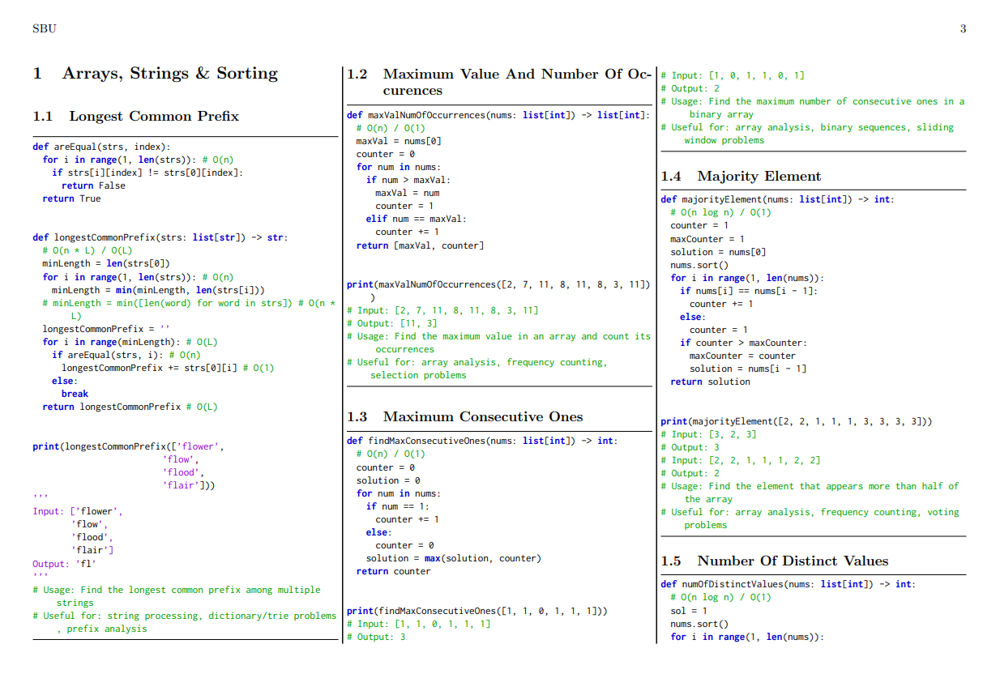
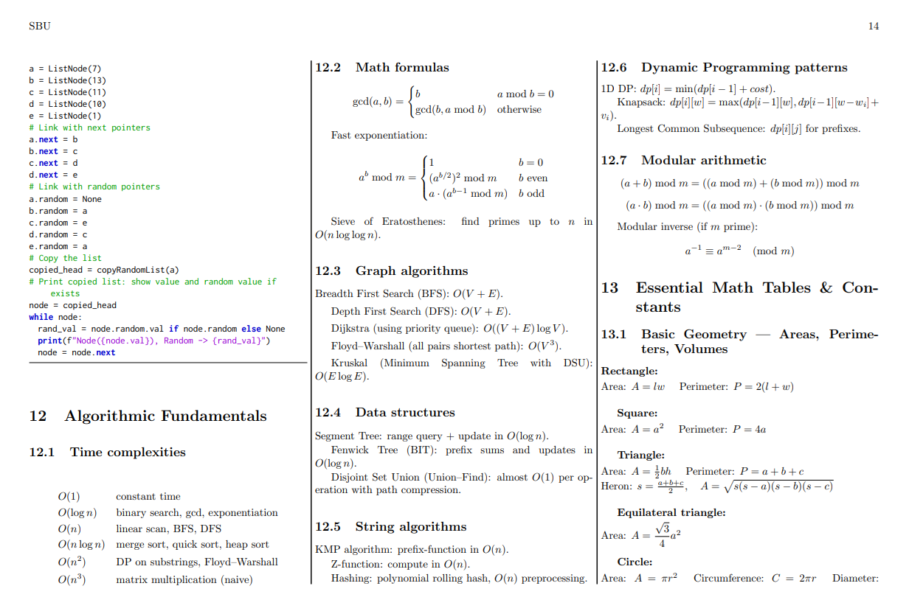

# source2pdf

**Auto-generate a PDF notebook from your source codes (useful for ACM-ICPC cheatsheets)**

This project is a fork of [codes2pdf](https://github.com/Erfaniaa/codes2pdf), which itself was a fork of [notebook-generator](https://github.com/pin3da/notebook-generator).  
Over the years, the project had accumulated some bugs that I fixed, and and I also added several useful features to improve functionality and usability.

---

## Features

- Works on **Linux** and **Windows**.
- Generates a **PDF notebook** with syntax-highlighted source codes.
- Supports `.c`, `.cpp`, `.cc`, `.java`, `.py`, `.tex` files.
- Renders LaTeX `.tex` files directly.
- Three-column layout per page (improved from original two-column layout).
- Customizable **title**, **author/team info**, and **date** in the notebook header.

---

## Dependencies

You need **TeX Live** installed to compile PDFs.

**Linux:**

```bash
sudo apt install texlive
```

**Windows:**

Download and install from: [TeX Live Windows Installer](https://www.tug.org/texlive/acquire-netinstall.html)

---

## Install

```bash
npm install -g source2pdf
```

---

## Usage

```bash
source2pdf <source_dir> [options]
```

**Options:**

```
-V, --version               output the version number
-o, --output [filename]     output file for the notebook. Default: ./notebook.pdf
-t, --title [title]         title to be displayed on the first page (default: "Competitive Programming Cheat Sheet")
-u, --university [name]     university name to be added in the notebook
-i, --initials [initials]   initials of the university/team to be placed in the upper-right corner of all pages
-n, --team [name]       name of the team to be displayed in the notebook
-m, --members [names]       names of team members to be added in the header
-d, --date [date]           date to be displayed in the notebook (default: today)
-h, --help                  output usage information
```

**Examples:**

```bash
# Generate a PDF notebook from the current directory (default filename: notebook.pdf)
source2pdf ./

# Generate a PDF notebook with university and team information
source2pdf ./ --title "ICPC Asia Regional 2025" --university "Sharif University of Technology" --initials SUT --team "Init to win it" --members "Ali Ghanbari, Zahra Ghalvenave" --output ./team_notebook.pdf
```

> The second command will create a PDF file named `team_notebook.pdf` in the current directory, with three columns per page, a table of contents, and the provided title/university/team info in the header.

---

## Example PDF

See an example notebook here: [notebook.pdf](https://github.com/AliBinary/source2pdf/blob/master/sample_notebook/sample_notebook.pdf)

> Note: The original project used two columns per page; in this version, the generated PDF has three columns per page, allowing you to fit more source code in fewer pages while keeping the layout clean.

---

## Sample PDF Screenshots

Here are a few screenshots of the generated PDF notebook:






---

## Notes

- **Directory Structure:** For a clean and organized table of contents, it is recommended to use up to **3 levels of nested folders** in your source code directory. Excessive nesting may make the TOC cluttered.
- **Filenames:** Use **spaces instead of underscores** in filenames to produce a prettier and more readable table of contents.
- **Supported File Types:** The generator supports `.c`, `.cpp`, `.cc`, `.java`, `.py`, and `.tex` files. LaTeX (`.tex`) files are rendered as-is in the notebook.
- **PDF Layout:** The generated PDF uses a **three-column layout** per page (unlike the original two-column version), allowing more source code to fit in fewer pages.
- **Syntax Highlighting:** Source code files are automatically syntax-highlighted using LaTeX’s `listings` package, so your code is easier to read.
- **Customizable Header:** You can include a title, university/team information, and initials in the header of every page using the command-line options.
- **Adding Examples:** You can include `.tex` files as examples, formulas, or explanations, which will be rendered directly in the PDF.
- **Performance Tip:** Avoid extremely large files in a single directory to keep PDF compilation fast and smooth.

---

## License

MIT License © AliBinary
